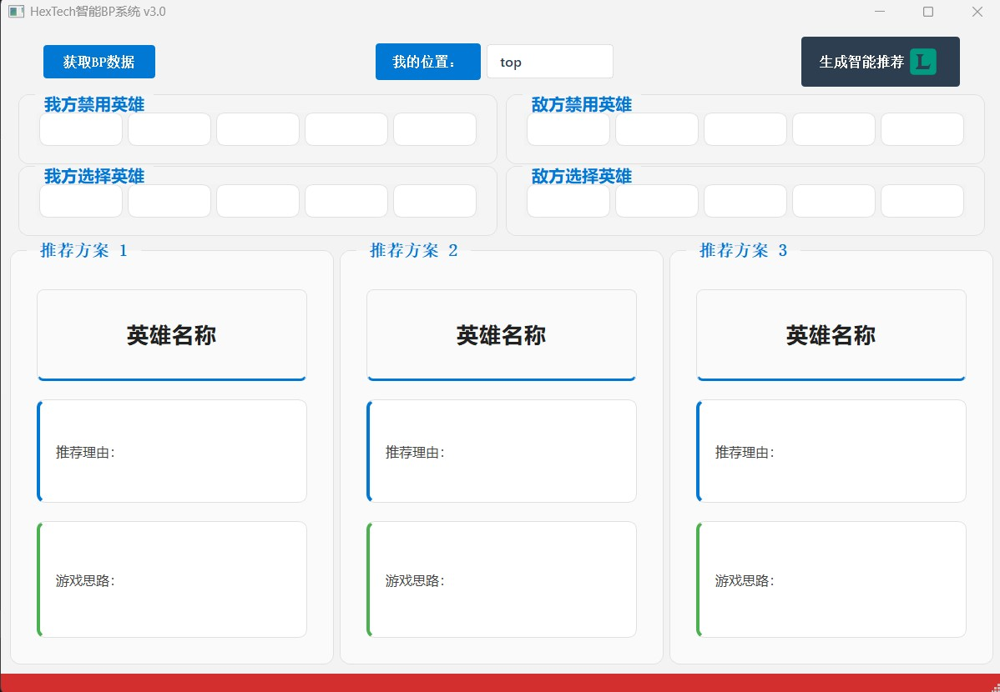

# 英雄联盟BP与游戏思路推荐系统

## 项目简介

本项目是一个基于大型语言模型的英雄联盟辅助工具，旨在为玩家提供实时的英雄选择（Ban/Pick）建议和游戏策略推荐。通过连接英雄联盟客户端API，获取当前对局信息，结合大模型分析能力，为玩家提供个性化的游戏建议。

## 主要功能

- **实时BP推荐**：根据当前队伍阵容和对手选择，推荐最佳的英雄选择
- **对线策略**：针对特定对线组合提供详细的对线思路和技巧
- **团队配合**：分析团队阵容优势和劣势，提供团队配合建议
- **游戏节奏**：根据阵容特点推荐合适的游戏节奏和关键时间点
- 

## 技术架构

- **前端界面**：基于PyQt5构建的桌面应用程序
- **客户端连接**：通过League Client API获取游戏数据
- **数据分析**：使用大语言模型分析游戏数据并生成建议
- **数据存储**：本地缓存历史数据，支持离线模式

## 下载与安装

### 系统要求
- Windows 10/11 (64位)
- 英雄联盟客户端
- 管理员权限（首次运行时可能需要）

### 安装方法

#### 方法一：直接下载可执行文件
1. 访问[最新发布页面](https://github.com/Aiwenqiuyu/hextech/releases/tag/v1.0.0)
2. 下载 `Hextech.exe` 安装程序
3. 运行安装程序


#### 从源码安装

1. 克隆仓库到本地
```
# 克隆整个仓库
git clone https://github.com/Aiwenqiuyu/hextech.git

# 进入仓库目录
cd hextech

# 切换到特定标签
git checkout v1.0.0
```

2. 安装依赖
```
bash
pip install -r requirements.txt
```
3. 运行程序
```
bash
python main.py
```

## 使用说明

1. 启动英雄联盟客户端并登录
2. 运行本程序
3. 进入英雄选择界面后，程序将自动连接,点击获取BP信息，无误后点击生成推荐
4. 查看推荐的BP选择和游戏策略

## 常见问题

### 程序无法启动
- 确保已安装所有必要的依赖
- 尝试以管理员身份运行
- 检查防火墙设置是否阻止了程序

### 无法连接到英雄联盟客户端
- 确保英雄联盟客户端已启动并登录
- 重启英雄联盟客户端后再试
- 检查程序日志获取详细错误信息

### 自动更新问题
- 如果自动更新失败，请访问GitHub发布页面手动下载最新版本
- 确保您的网络连接稳定

## 功能截图



## 版本历史

### v1.0.0 (2025-03-15)
- 首次公开测试版本发布
- 支持基本的BP推荐功能
- 实现客户端连接和数据分析


## 开发计划

- [ ] 添加更多英雄数据和对局分析
- [ ] **装备推荐**：基于对局情况提供动态的装备构建建议
- [ ] 集成游戏内覆盖显示功能
- [ ] 添加历史数据分析
- [ ] 支持自定义策略偏好设置

## 技术细节

本项目利用大型语言模型的强大分析能力，结合英雄联盟的游戏机制和当前版本数据，为玩家提供个性化的游戏建议。系统通过以下步骤工作：

1. 连接英雄联盟客户端API获取实时数据
2. 分析当前选择阶段和已选/禁用英雄
3. 结合版本强势英雄数据和玩家历史数据（待开发）
4. 通过大模型生成针对性建议
5. 实时更新并展示给用户

## 贡献指南

欢迎贡献代码、提出问题或建议！请遵循以下步骤：

1. Fork 本仓库
2. 创建您的特性分支 (`git checkout -b feature/amazing-feature`)
3. 提交您的更改 (`git commit -m 'Add some amazing feature'`)
4. 推送到分支 (`git push origin feature/amazing-feature`)
5. 开启一个 Pull Request

## 许可证

本项目采用 GPLV3 许可证 - 详情请参见 [LICENSE](LICENSE) 文件

## 联系方式

- 项目维护者：[爱睡觉的大蚂蚁](wangsr19@tsinghua.org.cn)
- 项目主页：[GitHub仓库地址](https://github.com/Aiwenqiuyu/hextech)
- 问题反馈：[提交Issue](https://github.com/Aiwenqiuyu/hextech/issues)

## 支持项目

如果您觉得这个项目对您有帮助，可以通过以下方式支持我们：

- 在GitHub上给项目点星
- 向朋友推荐这个项目
- 提交功能建议或代码贡献
- [赞助开发者](https://github.com/sponsors/Aiwenqiuyu)（如果有设置的话）

---

**免责声明**：本项目不隶属于Riot Games，不代表或反映Riot Games或任何官方参与英雄联盟的人的观点或意见。英雄联盟和Riot Games是Riot Games, Inc.的商标或注册商标。